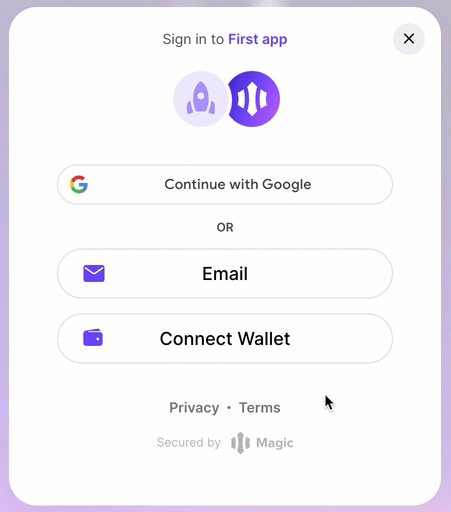

## Intro

This scaffold is meant to help you bootstrap your own wallet using Magic's [Dedicated Wallet](https://magic.link/docs/auth/overview) and [Noves data](https://docs.noves.fi). Magic is a developer SDK that integrates with your application to enable passwordless Web3 onboarding. Noves is a data provider specialized in translating smart contract complexity into human-readable form.

The folder structure of this repository is designed to encapsulate all possible elements into one place so you can easily add or remove components and functionality. For example, all Magic-specific components are in the `src/components/magic` directory while generic UI components are in the `src/components/ui` directory.

The backend functionality for calling Noves APIs has been implemented in the /api pages, following the standard structure for a Next.JS application.

For Noves-enriched data samples, check out the Transaction History and Transaction Preview components.

## Live version of demo

A live, deployed version of this app is available here:

[https://magic-demo.noves.fi/](https://magic-demo.noves.fi/)

To get the full experience, try connecting your Metamask wallet (with an address that has some transactions already on Ethereum mainnet). Then you'll get a human-readable transaction history automatically populated.

Here's a demo of how you can do that:



## Implementation details

This is a [Next.js](https://nextjs.org/) project bootstrapped with [`create-next-app`](https://github.com/vercel/next.js/tree/canary/packages/create-next-app).

### Running the app

First, make sure you set the environment variables in .env file.

```bash
# Publishable API Key found in the Magic Dashboard
NEXT_PUBLIC_MAGIC_API_KEY=pk_live_********

# The name of the chain
NEXT_PUBLIC_BLOCKCHAIN_NETWORK=polygon | ethereum

# API Key found in Noves Dashboard
NEXT_PUBLIC_TRANSLATE_API_KEY=********
```

Then, run the development server:

```bash
npm run dev
# or
yarn dev
# or
pnpm dev
```

### Deploying with Docker

If you want to run this inside a Docker container, we've included a Dockerfile and a helper Python script (`replaceValues.py`), which will write to a local
.env file in the container any needed environment variables.

This is helpful when deploying the container using a CI/CD pipeline and wanting to inject sensible values from a secrets manager / key vault into the pipeline.

The script assumes that an .env.production file like the one available in the repository (with placeholder values, exactly as currently configured) will be available to write to.

When Next.JS runs, it will read from that file, after the placeholder values have been replaced with the injected ones.

## More documentation

You can learn more about building a world-class wallet experience at the following links:

[https://docs.noves.fi](https://docs.noves.fi)

[https://magic.link/docs](https://magic.link/docs/)
